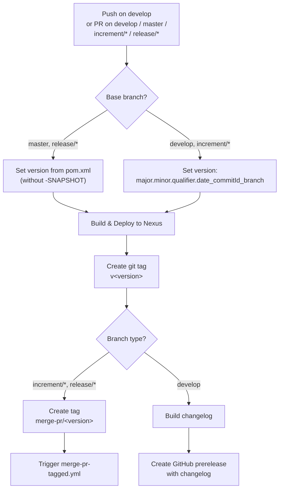
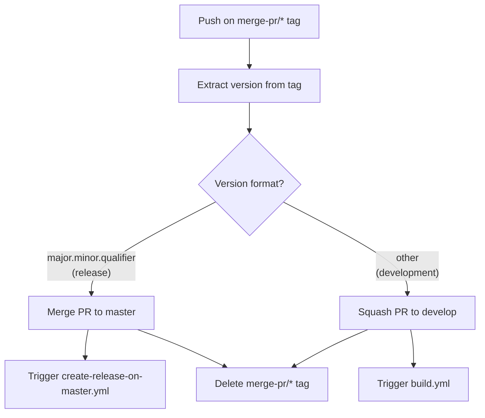
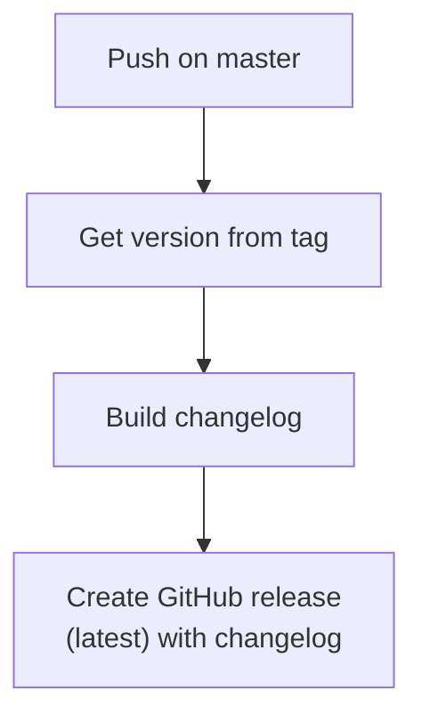
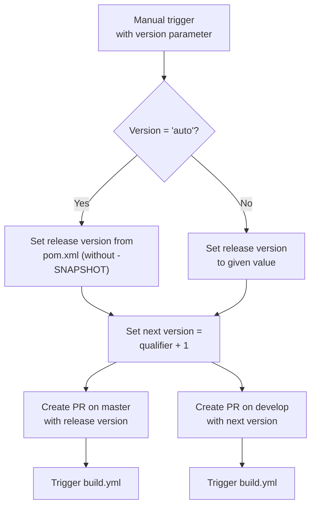
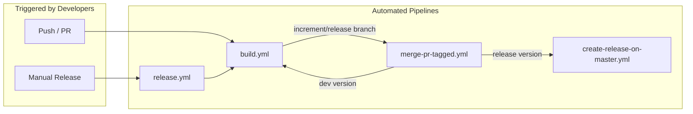

# Development Version and Branch Handling

This document describes the branching strategy, version numbering, and CI/CD pipeline for judo-meta-psm. The project follows a GitFlow-based workflow with automated builds via GitHub Actions.

## Branches

The project uses [GitFlow](https://www.atlassian.com/git/tutorials/comparing-workflows/gitflow-workflow) for version and branch management:

| Branch Pattern | Purpose | Based On |
|---------------|---------|----------|
| `develop` | Latest development sources for the active version | — |
| `feature/JNG-xxx_summary` | New features in development | `develop` |
| `release/X.Y.Z` or `X_Y_betaN` | Release stabilization | `develop` |
| `bugfix/JNG-xxx_summary` | Bug fixes during release testing | release branch |
| `support/JNG-xxx_summary` | Minor updates for previous releases | release branch |
| `hotfix/JNG-xxx_summary` | Urgent fixes for production | `master` |
| `master` | Latest released sources | — |

### Branch Lifecycle

```mermaid
gitGraph
    commit id: "initial"
    branch develop
    checkout develop
    commit id: "dev-1"
    branch feature/JNG-1
    commit id: "feat-1"
    commit id: "feat-2"
    checkout develop
    merge feature/JNG-1
    commit id: "dev-2"
    branch feature/JNG-2
    commit id: "feat-3"
    checkout develop
    merge feature/JNG-2
    branch release/1.0-beta1
    commit id: "rc-1"
    branch bugfix/JNG-4
    commit id: "fix-1"
    checkout release/1.0-beta1
    merge bugfix/JNG-4
    checkout develop
    merge release/1.0-beta1
    checkout master
    merge release/1.0-beta1 id: "v1.0"
```

## Version Numbers

Version numbers follow semantic versioning with these rules:

| Event | Version Change |
|-------|---------------|
| Start a `feature/` branch | No change — inherits from `develop` |
| Start a `release/` branch | 2nd number on `develop` is incremented |
| Start a `bugfix/` branch | No change — applied on release branch before merging to `master` |
| Start a `support/` branch | 3rd number is incremented — supports a previous release with minor changes |
| Start a `hotfix/` branch | 4th number is incremented — applied to both release and `master` |

## GitHub Actions Workflows

### build.yml — Main Build Pipeline

Runs on pushes to `develop` and pull requests targeting `develop`, `master`, `increment/*`, or `release/*` branches.



### merge-pr-tagged.yml — PR Merge Automation

Triggered when a `merge-pr/*` tag is pushed.



### create-release-on-master.yml — Release Finalization

Triggered when code is pushed to `master`.



### release.yml — Manual Release

Triggered manually with a version parameter (either `auto` or a specific `major.minor.qualifier`).



### CI Workflow Orchestration



## Development Rules

> **Important:** There is no commit without a ticket number. Every pull request and commit must include a JIRA reference (e.g., `JNG-1234`).
