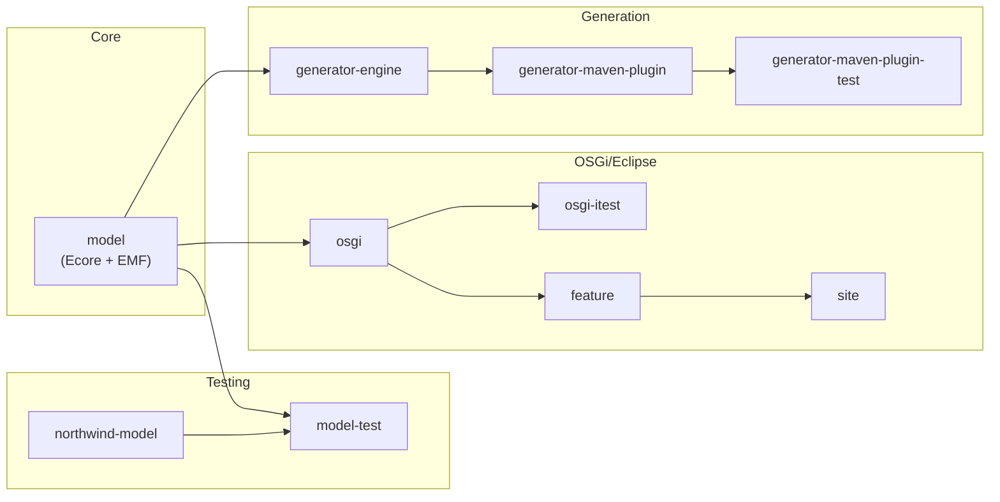
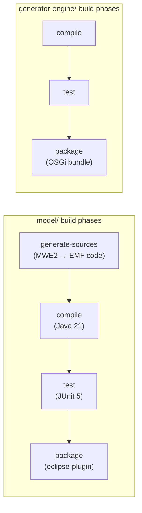

# Contributing to JUDO

This guide covers everything you need to set up a development environment, understand the project structure, and submit changes to judo-meta-psm.

## Development Environment Setup

### Prerequisites

Your development environment must comply with the requirements in the parent project's [Contributing Guide](https://github.com/BlackBeltTechnology/judo-community/blob/develop/CONTRIBUTING.adoc). In summary:

- **Java 21** JDK (OpenJDK Zulu recommended)
- **Maven 3.9.4+** (or use the included `./mvnw` wrapper)

### Verify Your Setup

```bash
java -version    # Should show Java 21
./mvnw --version # Should show Maven 3.9.4+
```

## Code Structure

This project follows standard Maven conventions with additional Eclipse/OSGi tooling via Tycho. Modules are grouped into three categories:

### Eclipse Modules

| Module | Purpose |
|--------|---------|
| `feature/` | Eclipse feature definition — packages the model plugin for Eclipse installation |
| `site/` | Eclipse P2 Update Site — built versions are compiled as update sites with version-specific URLs |

> **Note:** Update site URLs encode version numbers. Because Tycho loads the category definition before Maven can substitute properties, a special Maven profile handles version replacement:
>
> ```bash
> mvn clean install -P update-category-versions -f site/pom.xml
> ```

### Model Modules

| Module | Purpose |
|--------|---------|
| `model/` | Eclipse plugin containing the Ecore metamodel and EMF-generated Java classes. Builders and helpers are generated via MWE2 workflow. |
| `model-test/` | Unit tests for PSM model validation using Epsilon validators |
| `northwind-model/` | Reference test model based on the classic Northwind database schema |

### OSGi Modules

| Module | Purpose |
|--------|---------|
| `osgi/` | OSGi bundle that repackages the model and adds services for consumption in transformation pipelines on non-Eclipse platforms |
| `osgi-itest/` | Integration tests for the OSGi bundle using Pax Exam |

### Code Generation Modules

| Module | Purpose |
|--------|---------|
| `generator-engine/` | Core generation engine using Handlebars templates, SpringEL expressions, and YAML descriptors |
| `generator-maven-plugin/` | Maven plugin that wraps the generator engine for use in downstream project builds |
| `generator-maven-plugin-test/` | Integration tests for the Maven plugin |

### Module Dependency Flow



## Working with Eclipse

### Required Eclipse Plugins

- **m2e** — Maven integration
- **Epsilon** — Model validation language support
- **Modeling Tools** — EMF/Ecore editors

### Installation

Install the PSM plugin via P2 update sites: go to *Install New Software* and add the URL from the GitHub releases page (or point to an uncompressed ZIP folder). The plugin includes the metamodel and default editor UI.

### Code Generation in Eclipse

To run code generation inside Eclipse, use the MWE2 Launcher:

1. Navigate to `hu.blackbelt.judo.meta.psm.model` project
2. Right-click `src/workflow/generateModel.mwe2`
3. Run As → MWE2 Workflow

### Build Lifecycle



## Troubleshooting

### JUnit Tests in Eclipse

There is a known issue with Eclipse and Tycho where the classpath does not include JUnit automatically. A `Required-Bundle` entry has been added to the OSGi Manifest as a workaround (not the Tycho-recommended approach).

See: [Eclipse Bug 534587](https://bugs.eclipse.org/bugs/show_bug.cgi?id=534587)

### Lombok Incompatibility

Tycho does not support Lombok code generation directly ([lombok#285](https://github.com/rzwitserloot/lombok/issues/285)). **No Lombok is used in Eclipse plugin modules** — all source code in `model/` is EMF-generated.

## Version Policy

This project bridges two versioning conventions:

| Convention | Format | Example |
|-----------|--------|---------|
| **Maven** | `MAJOR.MINOR.PATCH-SNAPSHOT` | `1.3.0-SNAPSHOT` |
| **Eclipse/OSGi** | `MAJOR.MINOR.PATCH.qualifier` | `1.3.0.qualifier` |

These are equivalent: `1.0.0.qualifier` = `1.0.0-SNAPSHOT`. The Tycho Versions Plugin replaces qualifiers with a technical version number (timestamp + commit hash) in every CI build.

## Submission Guidelines

### Submitting an Issue

Before submitting, search the [issue tracker](https://github.com/BlackBeltTechnology/judo-meta-psm/issues) — your problem may already be resolved.

To help us reproduce and fix bugs quickly, please provide:

- Output of `java -version` and `mvn -version`
- Relevant `pom.xml` or `.flattened-pom.xml`
- A minimal reproduction case

### Submitting a Pull Request

This project follows [GitHub's standard forking model](https://guides.github.com/activities/forking/). Fork the repository, make your changes, and submit a pull request.

> **Important:** Every commit must reference a JIRA ticket number (e.g., `JNG-1234`).

For details on the CI pipeline, see the [CI Flow documentation](.github/CIFLOW.md).

## Commands

### Run Tests

```bash
./mvnw clean test
```

### Run Full Build

```bash
./mvnw clean install
```

### Run a Specific Test

```bash
./mvnw test -Dtest=PsmValidationDataTest
./mvnw test -Dtest=PsmValidationDataTest#testMethodName
```

### Skip Tests

```bash
./mvnw clean install -DskipTests
```

### Regenerate EMF Model Code

```bash
./mvnw -f model/pom.xml clean generate-sources
```
