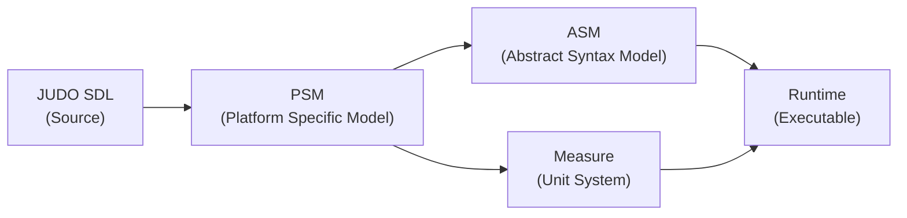
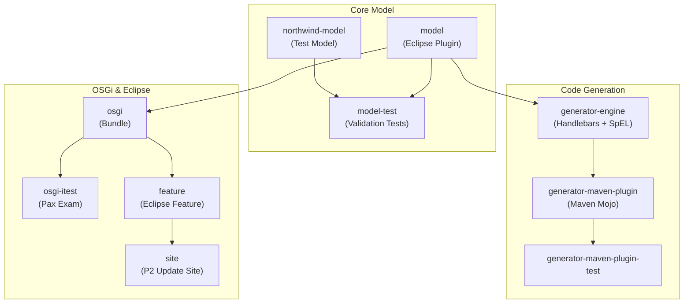
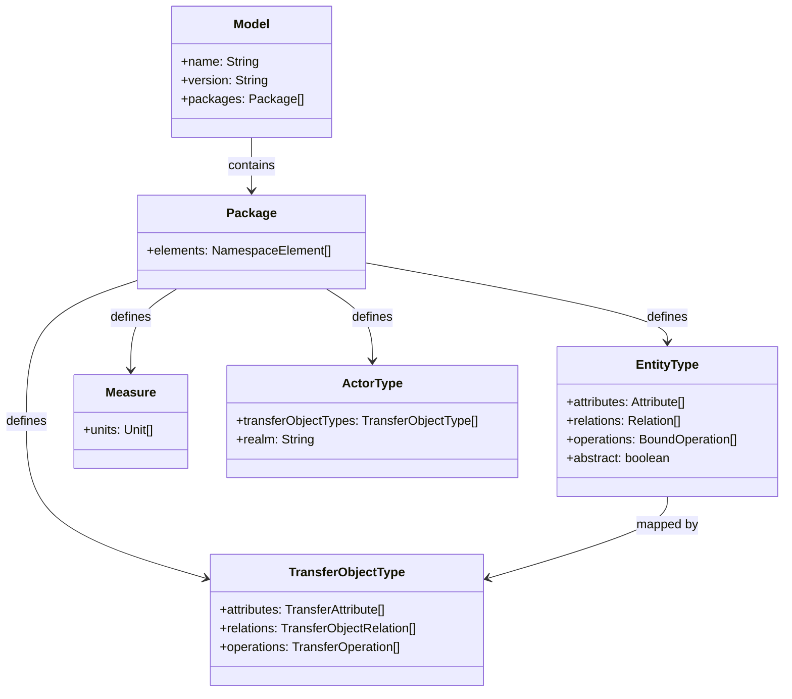

# judo-meta-psm

## Introduction

**PSM** stands for **Platform Specific Model**. This repository contains the PSM metamodel — the foundational data model for the [JUDO](https://github.com/BlackBeltTechnology/judo-community) framework's model-driven application development approach.

The PSM metamodel defines the structure of business application models: entities, attributes, relations, services, transfer objects, measures, and access points. It is implemented using the [Eclipse Modeling Framework (EMF)](https://www.eclipse.org/modeling/emf/) and can run as an Eclipse plugin, a standalone library, or an OSGi bundle (without Eclipse).

### Where PSM Fits in the JUDO Ecosystem

PSM is the **first model in the transformation chain**. Source models (e.g., JUDO SDL) are compiled into PSM, which is then transformed into downstream models:

### Module Architecture

The project is organized into several Maven modules, each serving a distinct role in the metamodel lifecycle:

### Key Components

| Component | Description |
|-----------|-------------|
| **Ecore Metamodel** (`model/model/psm.ecore`) | The source-of-truth EMF definition of all PSM concepts (entities, types, services, measures, etc.) |
| **Epsilon Validators** (`model/src/main/epsilon/validations/`) | Validation rules written in EVL (Epsilon Validation Language) that enforce metamodel constraints |
| **PsmUtils** | Core utility class for FQN resolution, namespace traversal, and inheritance queries |
| **Generator Engine** | Template-based code generation using Handlebars templates, Spring Expression Language, and YAML project descriptors |
| **OSGi Bundle Tracker** | Discovers PSM models in OSGi bundles and registers them as services |

### Metamodel Domain Overview

## Context

This project is a building block of the [judo-community](https://github.com/BlackBeltTechnology/judo-community) aggregator project. For a broader understanding of how this module fits into the ecosystem, see the corresponding documentation there.

## Contributing

Everyone is welcome to contribute to JUDO! Please read the [Contributing Guide](CONTRIBUTING.md) for details on development setup, branching strategy, and submission guidelines.

## License

This project is licensed under the [Eclipse Public License - v 2.0](https://www.eclipse.org/legal/epl-2.0/).
