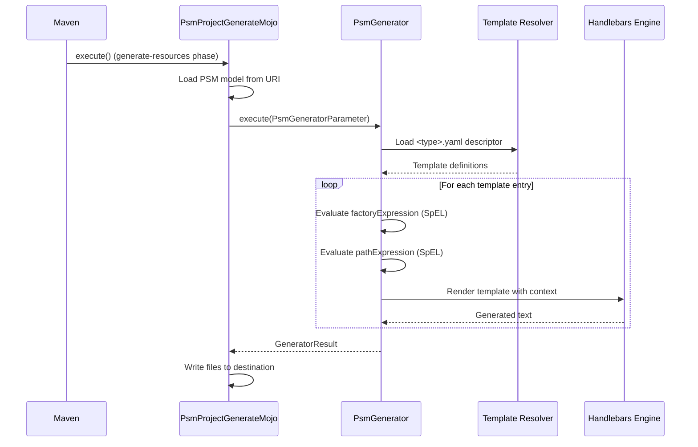
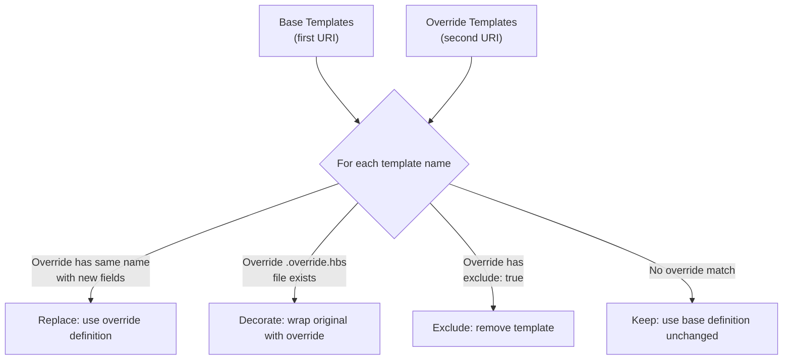

# JUDO PSM Generator Maven Plugin

This Maven plugin manages and executes template-based code generators for JUDO PSM models. It transforms PSM model elements into text-based output (source code, configuration files, reports) using Handlebars templates combined with Spring Expression Language (SpEL).

## How Generation Works

The plugin reads a PSM model and a set of Handlebars templates, then produces output files according to a YAML project descriptor. The generation pipeline supports layered template overrides, actor-type-based generation, and custom helper classes.



## Requirements

- Maven 3.9.4+
- Java 21

## Installation

Include the plugin in your Maven project. Replace `LATEST_VERSION` with the latest tagged version:

```xml
<plugin>
    <groupId>hu.blackbelt.judo.meta</groupId>
    <artifactId>judo-psm-generator-maven-plugin</artifactId>
    <version>LATEST_VERSION</version>
</plugin>
```

## Usage

### Full Configuration Example

```xml
<plugin>
    <groupId>hu.blackbelt.judo.meta</groupId>
    <artifactId>judo-psm-generator-maven-plugin</artifactId>
    <version>${judo-psm-archetype-version}</version>
    <executions>
        <execution>
            <id>execute-psm-test-model-from-artifact</id>
            <phase>test</phase>
            <goals>
                <goal>generate</goal>
            </goals>
            <configuration>
                <psm>mvn:hu.blackbelt.judo.tatami:judo-tatami-northwind-psm:${version}!model/northwind-psm.model</psm>
                <uris>
                    <uri>mvn:hu.blackbelt.judo.meta:judo-psm-fullstack-project-archetype:${version}</uri>
                    <uri>${basedir}/src/main/resources</uri>
                </uris>
                <helpers>
                    <helper>hu.blackbelt.judo.psm.fullstack.project.archetype.PsmProjectHelper</helper>
                </helpers>
                <type>fullstack-project</type>
                <destination>${basedir}/target/test-classes/psm/artifact</destination>
                <templateParameters>
                    <judoPlatformVersion>${judo-platform-version}</judoPlatformVersion>
                </templateParameters>
                <contextAccessor>hu.blackbelt.judo.psm.fullstack.project.archetype.ActorTypeValueResolver</contextAccessor>
                <scanDependencies>true</scanDependencies>
                <actors></actors>
            </configuration>
        </execution>
    </executions>
    <dependencies>
        <dependency>
            <groupId>hu.blackbelt.judo.meta</groupId>
            <artifactId>hu.blackbelt.judo.meta.psm.model.northwind</artifactId>
            <version>${judo-meta-psm-version}</version>
        </dependency>
    </dependencies>
</plugin>
```

### Configuration Parameters

| Parameter | Required | Description |
|-----------|----------|-------------|
| `psm` | No | PSM model URI. Supports file paths and Maven artifact coordinates. |
| `uris` | Yes | Template URIs, loaded in reverse order (last URI has highest priority). Templates from later URIs override earlier ones. |
| `helpers` | No | Fully qualified class names of helper classes. Available in both SpEL expressions and Handlebars templates. Classes implementing `ValueResolver` are auto-registered as Handlebars value resolvers. |
| `type` | Yes | Project type identifier. Resolves to `<type>.yaml` descriptor file within the template URIs. |
| `destination` | No | Output directory. Default: `${project.basedir}/target/classes/model`. When multiple actors are defined, each gets a separate subdirectory by name. |
| `templateParameters` | No | Key-value pairs accessible in SpEL and Handlebars templates by name. |
| `contextAccessor` | No | Class that receives Handlebars, SpEL, and parameter contexts via `bindContext()` methods. When `scanDependencies=true`, classes annotated with `@ContextAccessor` are auto-detected. |
| `scanDependencies` | No | When `true` (default), scans classpath for `@TemplateHelper` and `@ContextAccessor` annotated classes. Discovered helpers are merged with explicitly configured ones. |
| `actors` | No | Comma-separated FQNs of ActorType classes to generate. When empty, all actors are generated. |

### URI Format

Both file paths and Maven artifact coordinates are supported:

```
mvn:<groupId>:<artifactId>[:<extension>[:<classifier>]]:<version>[!path/in/archive]
```

## Project Descriptor (`<type>.yaml`)

The YAML descriptor controls what templates are rendered, how output paths are computed, and what context variables are available. All expressions use Spring Expression Language (SpEL).

### Template Entry Fields

```yaml
- name: file_for_actor           # (1) Unique template identifier
  factoryExpression: "{#actorTypes}"  # (2) SpEL expression returning a list of context objects
  actorTypeBased: false           # (3) If true, template runs once per ActorType
  exclude: false                  # (4) Set true in overrides to suppress this template
  pathExpression: >               # (5) SpEL expression computing the output file path
    'lib/' +
    #path(#actorType.name) + '/' +
    'file_for_actor.test'
  templateName: lib/file_for_actor.test.hbs  # (6) Handlebars template file
  templateContext:                # (7) Additional variables injected into template
    - name: actorTypeAsVariable
      expression: "#self"
  copy: false                    # (8) If true, copy binary file instead of rendering template
```

| Field | Description |
|-------|-------------|
| `name` | Unique identifier — used for override matching across template layers |
| `factoryExpression` | SpEL expression returning a list; each item becomes the root context (`#self`) for one template rendering |
| `actorTypeBased` | When `true`, the template is invoked once per ActorType with `#actorType` available |
| `exclude` | In override layers, setting this to `true` removes the base template entirely |
| `pathExpression` | SpEL expression that must return a string — the output file path relative to the destination |
| `templateName` | Path to the Handlebars `.hbs` template file within the template URIs |
| `templateContext` | List of `{name, expression}` pairs injected as named variables in the template |
| `copy` | When `true`, the template file is copied as a binary — no Handlebars rendering is performed |

### Template Context Variables

These variables are automatically available in SpEL expressions and Handlebars templates:

| Variable | Type | Description |
|----------|------|-------------|
| `#model` | `Model` | The root PSM model |
| `#actorTypes` | `List<ActorType>` | All ActorType elements in the model |
| `#actorType` | `ActorType` | Current ActorType (when `actorTypeBased: true`) |
| `#self` | `Object` | Current context object from `factoryExpression` |
| `#template` | `GeneratorTemplate` | Current template definition |

## Template Override System

Templates support a layered override mechanism. When multiple URIs are configured, they are processed in reverse order (last URI wins). There are three ways to customize generation:

### 1. Replace a Template

Define an entry in the override layer with the same `name` — all fields from the base are replaced:

```yaml
# Override layer
templates:
  - name: testReplace
    pathExpression: "#actorType.name + '/actorReplaced'"
    templateName: test1/actorReplaced.hbs
    actorTypeBased: true
```

### 2. Decorate a Template

Create a file named `<original>.override.hbs` alongside the override. The override template can include the original using Handlebars fragment syntax:

```
{{> test1/actorToOverride.hbs}}
<!-- Additional content here -->
```

### 3. Exclude a Template

Set `exclude: true` in the override layer to remove a base template entirely:

```yaml
templates:
  - name: testDelete
    exclude: true
```

### Override Resolution



## Ignoring Generated Files

To prevent the generator from overwriting manually edited files, create a `.generator-ignore` file in the output directory. It uses glob format (same syntax as `.gitignore`).

## Context Accessor

The `contextAccessor` class can implement any combination of these `static` methods to receive different contexts:

```java
// Handlebars context (called just before rendering — not suitable for factory/path expressions)
public static void bindContext(com.github.jknack.handlebars.Context context)

// SpEL context (called before any templating — usable in YAML and templates)
public static void bindContext(org.springframework.expression.spel.support.StandardEvaluationContext context)

// External parameters (called before any templating)
public static void bindContext(java.util.Map<String, Object> parameters)
```

> **Tip:** Store context in `ThreadLocal` variables, because template rendering runs in multiple threads.

## Available Maven Goals

| Goal | Description |
|------|-------------|
| `generate` | Generate code from PSM model using templates |
| `reset-checksum` | Reset file checksums for regeneration tracking |
| `clean` | Remove generated files based on checksum records |
| `calculate-checksum` | Recalculate checksums for existing generated files |
| `synchronize-gitignore` | Update `.gitignore` with generated file entries |
