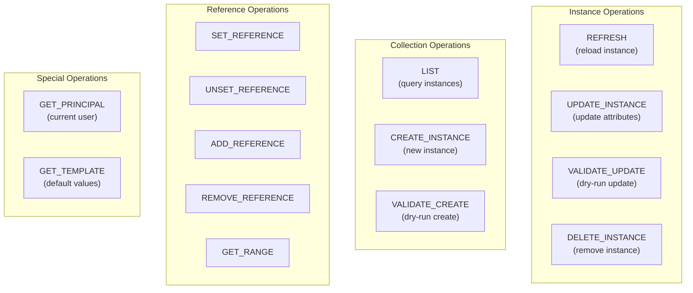
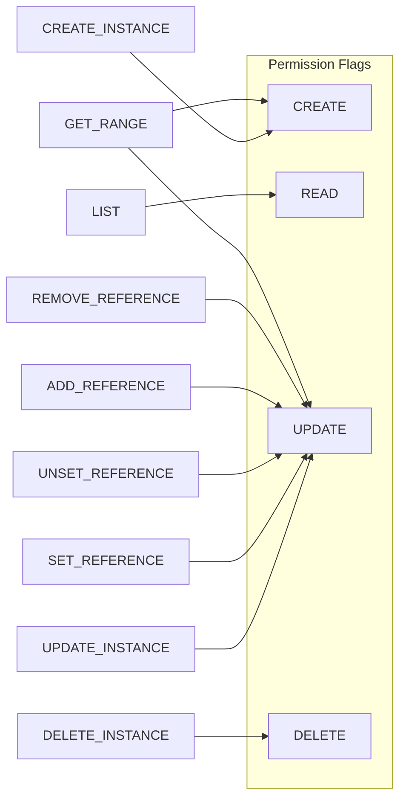

# PSM Model — Operation Behaviours

This document describes the built-in operation behaviours defined in the PSM metamodel. Each behaviour represents a standard CRUD or reference-management operation that the runtime can execute on transfer object types and their relations.

## Behaviour Overview

## Collection Operations

### LIST

| Property | Value |
|----------|-------|
| **Owner** | Relation |
| **Description** | Get list of instances. Return type is single or many based on the cardinality of the relation. |

Behaviour varies by relation type:

| Relation Type | Behaviour |
|--------------|-----------|
| **Access relation** | Returns list of target transfer object type, filtered by attributes of target mapped transfer object type |
| **Derived relation** | Evaluates expression and returns result as target transfer object type (with attribute filtering) |
| **Stored relation** | Returns stored relation result (with attribute filtering) |
| **Mapped relation** | Resolves based on mapping definition |
| **Transient relation** | Not supported |

### CREATE_INSTANCE

| Property | Value |
|----------|-------|
| **Owner** | Relation |
| **Description** | Create a new instance (restricted by filter attribute of mapped transfer object type). The new instance is attached if the relation type is stored. |

| Relation Type | Permission / Behaviour |
|--------------|----------------------|
| **Access relation** | Permission based on CREATE flag of access relation |
| **Stored relation** | Permission based on CREATE flag of producer (relation/operation) |
| **Mapped relation** | Resolved based on mapping definition |
| **Derived relation** | Not supported |
| **Transient relation** | Not supported |

### VALIDATE_CREATE

| Property | Value |
|----------|-------|
| **Owner** | Relation |
| **Description** | Validate input data of a CREATE_INSTANCE operation, then rollback on completion (dry-run). |

Permission model is identical to CREATE_INSTANCE.

## Instance Operations

### REFRESH

| Property | Value |
|----------|-------|
| **Owner** | Mapped transfer object type |
| **Description** | Refresh (reload) a mapped transfer object type instance from the data store. |

### UPDATE_INSTANCE

| Property | Value |
|----------|-------|
| **Owner** | Mapped transfer object type |
| **Description** | Update attributes of a mapped transfer object type. Permission is based on the UPDATE flag of the producer (relation/operation). |

### VALIDATE_UPDATE

| Property | Value |
|----------|-------|
| **Owner** | Mapped transfer object type |
| **Description** | Validate input data of an UPDATE_INSTANCE operation, then rollback on completion (dry-run). |

### DELETE_INSTANCE

| Property | Value |
|----------|-------|
| **Owner** | Mapped transfer object type |
| **Description** | Delete a mapped transfer object type instance. Permission is based on the DELETE flag of the producer (relation/operation). |

## Reference Operations

All reference operations have an **owner** (the relation) and a **subject** (the instance of the bound operation / container of the relation). Permission for all reference operations is based on the UPDATE flag of the subject.

### SET_REFERENCE

Set the reference of the subject to a given value. Works with both single and many relations.

### UNSET_REFERENCE

Unset a single, non-composition reference of the subject (clear the reference to null).

### ADD_REFERENCE

Add existing instance(s) to a many, non-composition reference of the subject.

### REMOVE_REFERENCE

Remove existing instance(s) from a many, non-composition reference of the subject.

### GET_RANGE

Get the range (available options) for a non-composition reference of the subject. Permission is based on the CREATE or UPDATE flag of the subject.

## Special Operations

### GET_PRINCIPAL

| Property | Value |
|----------|-------|
| **Owner** | Actor type |
| **Description** | Get the principal (transfer object type representation) of the current actor (logged-in user). |

### GET_TEMPLATE

| Property | Value |
|----------|-------|
| **Owner** | Transfer object type |
| **Description** | Return a transfer object type instance filled with default values. Not persisted in case of mapped transfer object type. |

> **Note:** GET_TEMPLATE is not supported yet.

## Operation Permission Model

